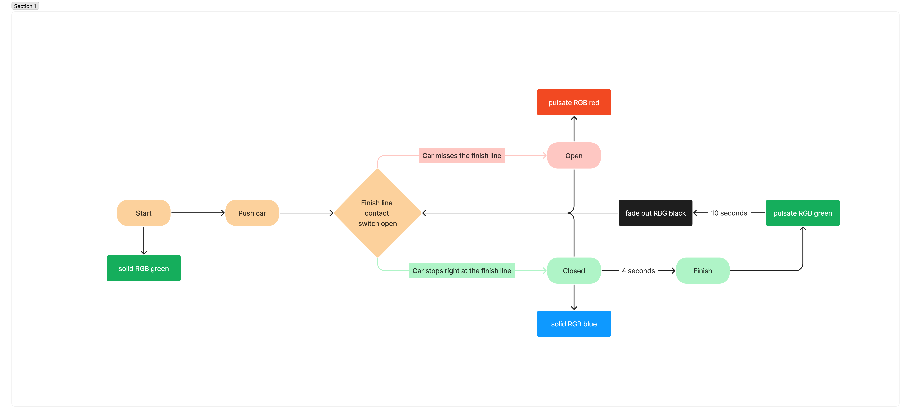

# Assignment #1

Digital input project: [link to this README file](./README.md)

Skill-based toy car game involving a lego car, straight road piece, and traffic light (RGB LED light)

## Game Rules

* Player brings car to the beginning of the straight road piece
* Player pushes car with a certain force in the attempt for the car to stop just at the finish line contact patch
* If car stops right on the contact patch, LED will turn solid red signifying success, then it will blink green signifying completion.
* If car misses the contact patch, LED will blink yellow.

## Design Process

Prototype Video:

Prototype Photos:

Flow chart:

Sketch for the game idea:

