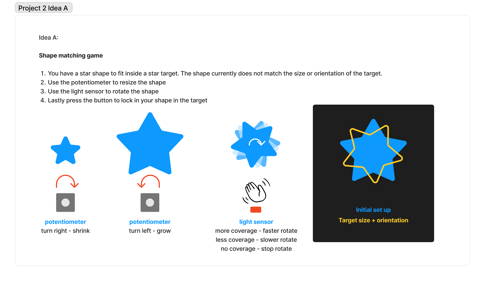
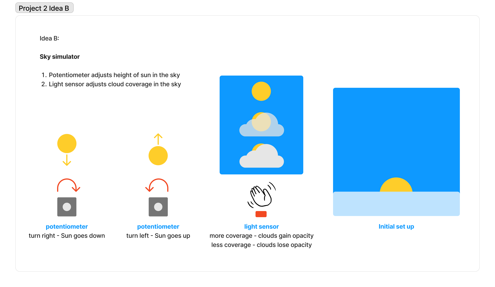

# Assignment #2

Linking analog inputs on hardware to outputs on screen through computer software

Link:
[Website](/website/) - Serial communication with PyScript and P5 graphics library 

## Design Process

Sketches:

Idea A

Idea B

