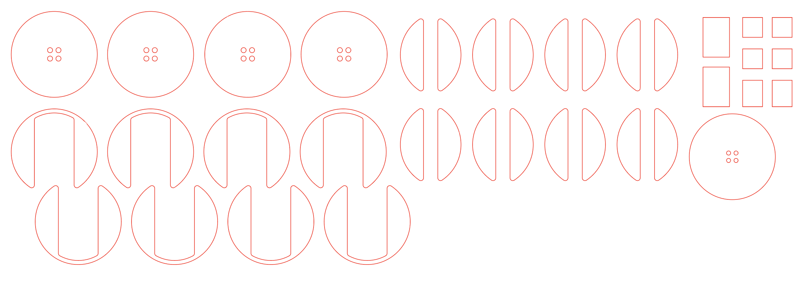

# Final Project

Hot Wheels Speed Trap

## Introduction   

Utilizing one light sensor to activate the turntable and two more light sensors to calculate the traveling speed of the cars, the Hot Wheels Speed Trap is an interactive track piece to enhance the play experience of your Hot Wheels toy cars. The initial idea was built upon project 3's light sensor activated servo unit turntable and expanded into an interactive track for Hot Wheels. The final project concept follows true to the initial sketches from part 1, with a single lane track placed on a slope built upon a lego technic chassis and laser cut acrylic cladding on the outside of the device.  

## Design Sketches


## Implementation   


### Enclosure / Mechanical Design   

The prototype began initially with reconstruction of my project 3 Rube Goldberg machine and new sketches. Based on the initial sketches, I took apart the Rube Goldberg machine made of lego technic parts and re-engineered the structure to mechanically support Hot Wheels orange track pieces.


The exterior enclosure is made from laser cut transparent 1/4" thick acrylic. On the largest piece, the Hot Wheels logo and "Speed Trap" are raster etched into the side for branding. 


The turntable is also made from laser cut white 1/8" thick acrylic. The pieces are stacked to create just the right amount of height to house the toy car without it falling out of the turntable, but not too thick so that the material gets too heavy and difficult to turn.




To create the connection between the turntable and servo unit, I had to create a custom gear set using lego technic gears. The main challenge was to translate the rotational motion along a horizontal axis from the servo into an angled vertical axis for the turntable to line up to the track. I connected one large gear to the servo unit, and connected that to a row of four smaller gears to translate the horizontal-axis rotation to vertical-axis rotation. Lastly I connected the last in the row of four gears to a CV joint piece, and connected that to the turntable gear. The laser cut turntable was then affixed to the turntable gear using lego technic connector pieces.


### Hardware

#### Components:
* One M5Stack AtomS3 Lite Controller
* One M5Stack ATOMIC PortABC Extension Base
* One Brick-compatible 360° Servo Unit
* Three Light Sensor Units with Photo-resistance

The underlying Rube Goldberg machine initially only had one light sensor and one servo unit, so I had to add on two additional light sensor units in order to create the speed sensor component for this project. I then changed the lego technic chassis to accomodate the two extra light sensors and cut out the backs of the orange tracks so that the light sensors could lie flush underneath the tracks seemlessly and perform properly to sense the toy cars passing over.

Section one of this device contains one light sensor unit and one servo unit. Covering the light sensor triggers the servo unit to begin turning slowly, so the presence of a waiting toy car covers the light sensor and the turntable turns until it lines up with the track and releases the toy car.

Section two of this device is the speed trap, composed of two sequential light sensors embedded into the track. The speed is calculated by dividing the fixed distance between the two light sensors, by the time spent for the car to travel between the two light sensors. I therefore programmed in the firmware to record the time difference between the triggering of the first light sensor and the triggering of the second light sensor.

#### Below are photos of how the light sensors are embedded into the track:


#### Here is the schematic diagram showing the wiring connections between the M5Stack AtomS3 board and the other components:


#### Below are photos of the hardware wiring in the device:


After creating the overall mechanical components of the prototype, I moved onto writing the firmware for the prototype's functionality. Due to the use of three adc sensors (the light sensors), I defined each one as a variable by the order which the toy car passes over them. So the first light sensor that activates the turntable is adc_sensor1. For the speed trap component, the two light sensors are named adc_sensor2 and adc_sensor3 respectively.

firmware (MicroPython code), software (HTML/CSS/JavaScript or other code), integrations (Adafruit IO, IFTTT, etc.)

Include a schematic diagram image (hand-drawn is OK) showing all the wiring connections between the M5Stack AtomS3 board and other components.  

In addition, include at least one photo showing your hardware wiring.  This can be several close-ups with the goal of showing how the wiring connections are made.  

### Firmware   

Provide a link to your MicroPython code and explain a few important parts that make your prototype work.  Most likely you should explain the inputs/outputs used in your code and how they affect the behavior of the prototype.

To include code snippets, you can use the code block markdown, like this:

``` Python  
if(input_val > 1000):  # sensor value higher than threshold
   led_pin.on()  # turn on LED
```

### Software   

If applicable, explain the important software components of your project with relevant code snippets and links.  

### Integrations   

Include a link to and/or screenshots of other functional components of your project, like Adafruit IO feeds, dashboards, IFTTT applets, etc.  In general, think of your audience as someone new trying to learn how to make your project and make sure to cover anything helpful to explain the functional parts of it.

## Project outcome  

Summarize the results of your final project implementation and include at least 2 photos of the prototype and a video walkthrough of the functioning demo.

## Conclusion  

As you wrap up the project, reflect on your experience of creating it.  Use this as an opportunity to mention any discoveries or challenges you came across along the way.  If there is anything you would have done differently, or have a chance to continue the project development given more time or resources, it’s a good way to conclude this section.

## Project references  

Please include links to any online resources like videos or tutorials that you may have found helpful in your process of implementing the prototype. If you used any substantial code from an online resource, make sure to credit the author(s) or sources.
